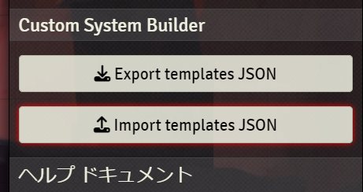
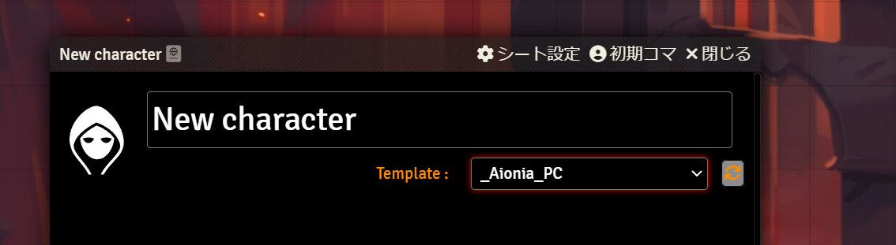
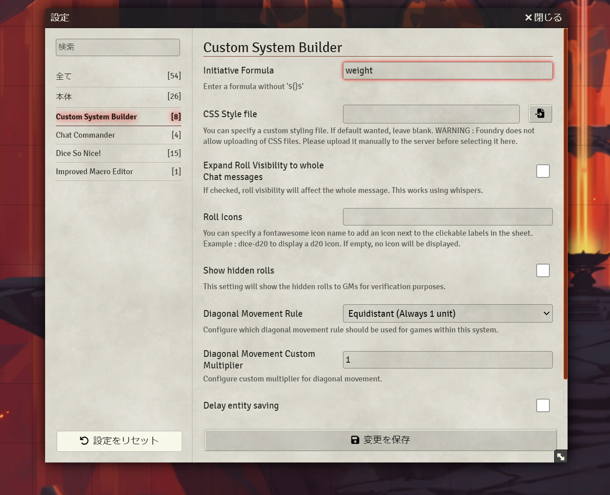
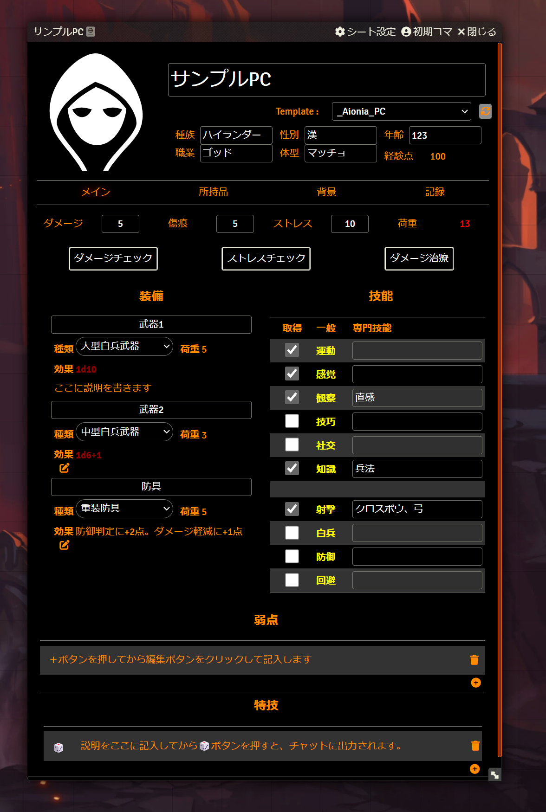
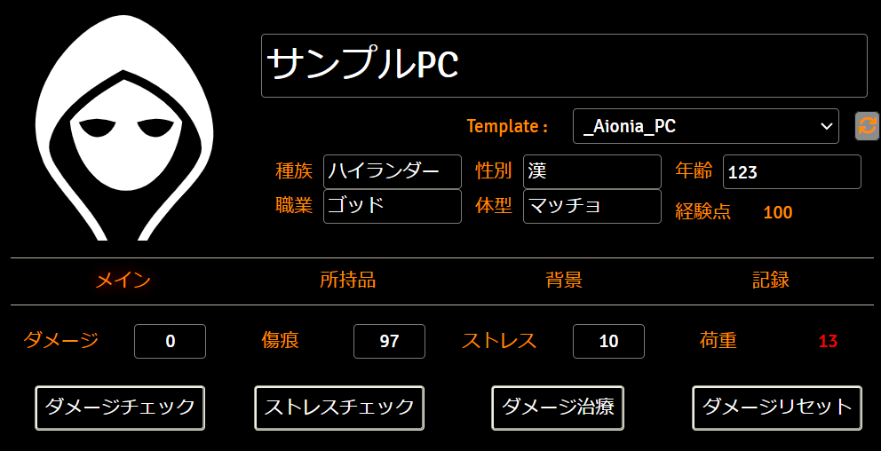
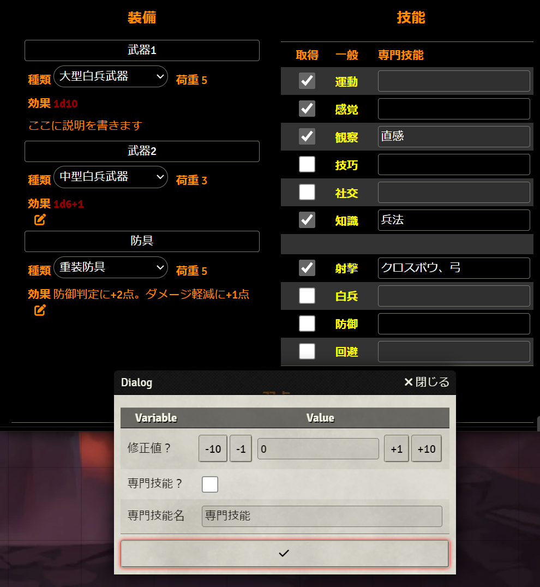
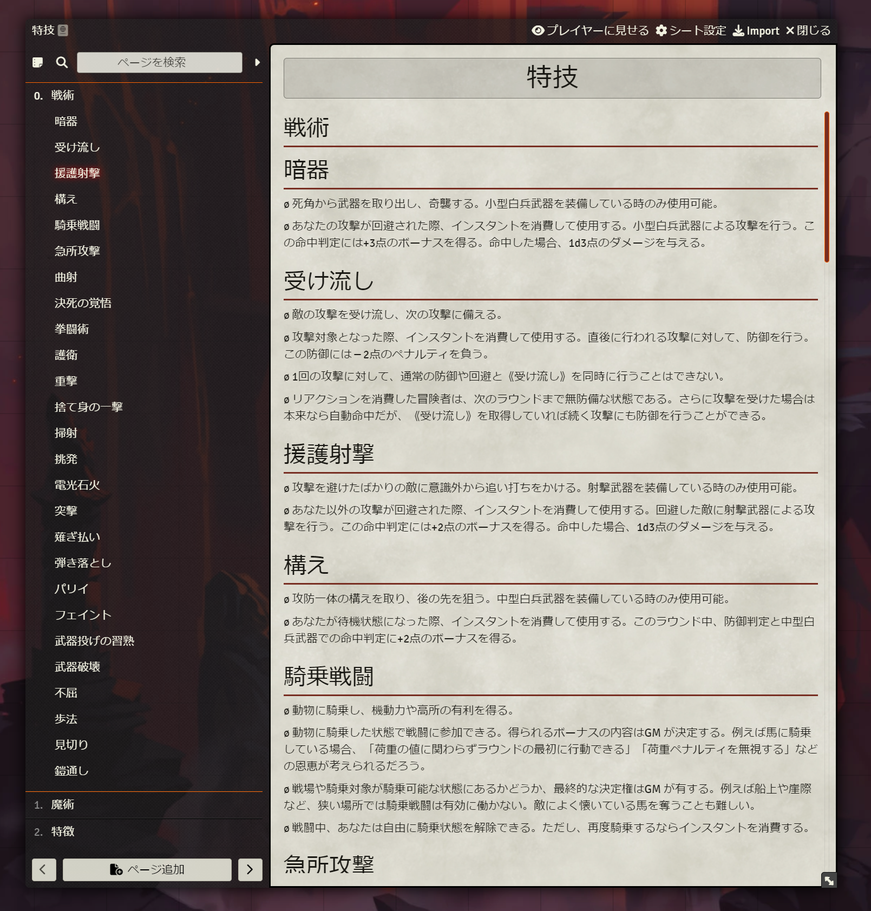

# 慈悲なきアイオニア Custom System Builder実装版

* **製作者**: 炯遊えいり/Brother Sharp
* **対応Custom System Builderバージョン**: 3.0.0+
* **対応本体バージョン**: Version 11 Build 315

## インストール方法
①以下のリンクを新しいモジュールとしてインストールしてください。
* リンク： https://raw.githubusercontent.com/BrotherSharper/dnd5eja/master/module.json

②新しいワールドを作成し、システムとしてCustom System Builderを選択してください。まだインストールしていない場合は、システム一覧から検索すればインストール可能です。

③新規ワールドに入室後、Import Templates JSONを選んでください。

その後、modules->aionia-csb-modの順にフォルダを移動して、aionia_template.jsonを選んでください。
新しいキャラクターとして_Aionia_Monsterと_Aionia_PCが導入されます。**このキャラクターは絶対に削除しないでください。**

④新規キャラクターを作成するときは「Character」を選んでください。

⑤空のキャラクターシートではTemplate:からPC用のテンプレート（_Aionia_PC）またはモンスター用テンプレート（_Aionia_Monster）を選んでください。横のぐるぐるボタンを押せばテンプレートが適用されます。これで使用の準備が整いました。

⑥FVTTのイニシアチブ管理表を使いたい人は、Modの設定から「Initiative Formula」に「weight」を入れてください。

## 概要

機能は以下のとおりです。

* **種族/性別/年齢/職業/体型**：自由記入欄です。なんでもいれることができます。
* **経験点**：「記録」タブにある変動を元に増減します。
* **ダメージ**：マウスをホバーすると数値を増減するボタンが出てきます。コマから操作したい場合は、初期コマ設定→リソース→attributeBar.damageを設定すると良いです。
* **傷痕**：マウスをホバーすると数値を増減するボタンが出てきます。下限は「記録」タブで増加した傷痕が設定されます。コマから操作したい場合は、初期コマ設定→リソース→attributeBar.scarを設定すると良いです。
* **ストレス**：マウスをホバーすると数値を増減するボタンが出てきます。コマから操作したい場合は、初期コマ設定→リソース→attributeBar.stressを設定すると良いです。
* **ダメージチェック**：1d100をロールしてダメージ＋傷痕の合計と比べます。失敗が1/5以下だった場合は☠マークで死亡の危険性を表示します。
* **ストレスチェック**：1d100をロールしてストレスの合計値と比べます。
* **ダメージ治療**：傷痕をダメージの半分（切り捨て）増加させます。その後、ダメージリセットボタンでダメージを０にしてください。今のバージョンではちょっとバグってるのでボタンを分けてますが、将来的にはワンクリックで動くようになります。
* **荷重**：装備品によって自動的に計算されます。緑：荷重ペナルティ無し、オレンジ：軽度のペナルティ、赤：重度のペナルティ

* **装備**：名前だけ記入して種類を選べば効果と荷重は自動的に設定されます。説明が必要な場合は鉛筆マークをクリックして記入できます。
* **技能**：黄色い名前をクリックするとロールダイアログが出てきます。取得にチェックが入ってないと1d10、取得にチェックが入ってると2d10、ダイアログの専門技能にチェックが入ってると3d10がロールされます。専門技能名が入ってない場合はデフォルトの「専門技能」が入ります。将来的にはGMの難易度も入れられるようにします。

それ以外のところは自由記入欄のみなので、使いながら覚えられるでしょう。特技のみ🎲ボタンがあるので、それを使って内容をチャットに表示することができます。

## 辞典
中にはすべての特技の辞典が含まれています。コピーして、特技の入力ダイアログにいれることで形が整った状態で入ります。

## クレジット表記
本作は「イチ（フシギ製作所）」が権利を有する『慈悲なきアイオニア』の二次創作物です。中に含まれる特技の文言はシステム開発者の許可を得て記載しています。

このシートはプレイの補助のみを行いますので、具体的なルールはルルブをご確認ください。
https://www.aioniatrpg.com/

## 二次利用
このシートをベースに改良・再配布したい方は自由に行っても構いませんが、自作発言のみやめてください。
問題が見つかりましたら作者へ連絡するか、リポジトリのIssueとして登録してください。待てばバグが修正されるような大きいプロジェクトじゃないので、気になることは報告をしてください。